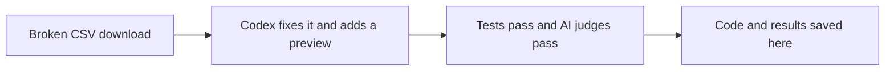

# See what Agentflow changed

This repo holds the app from a real Agentflow run. The task was to fix a broken customer CSV download and add a preview of the file.

**The app now passes all 29 export and preview checks.** All 13 app tests pass too. Both AI judges gave the work full marks. Both judges could run the tests. A later browser check found a bug: the download control stays visible if the preview request fails.

You can [read the results](results/README.md) on GitHub right now. To try the app below, you do not need Agentflow, a Codex account, or an API key.

## What happened



The run passed on its **first try** and took **12 minutes and 52 seconds**. Agentflow did not need to call in its helper agent. A high AI score does not mean the app has no bugs. This is an **open-book demo**: agents could read prior-result links and the task checks. See the [fairness audit](results/2026-09-24/operator/graph-audit.md).

| I want to… | Go here |
| --- | --- |
| Try the app | Follow the steps below |
| Read the scores and run story | [See the results](results/README.md) |
| Run the task from the start | [Use the before repo](https://github.com/koji98/agentflow-customer-export-before) |
| Understand the workflow | [See the steps and checks](showcase/AUTHORING.md) |

## 1. Get the tools

You need [Git](https://git-scm.com/downloads), [nvm](https://github.com/nvm-sh/nvm#installing-and-updating), and [Python 3.10 or later](https://www.python.org/downloads/). nvm installs the right Node.js version for this app: **24.18.0**.

Use a Bash or Zsh terminal on macOS or Linux. On Windows, use WSL2, which gives you a Linux terminal. These steps do not cover PowerShell.

You do not need a database, Docker, or an `.env` file.

## 2. Start the app

Paste these commands into your terminal:

```sh
git clone https://github.com/koji98/agentflow-customer-export-after.git
cd agentflow-customer-export-after
nvm install
nvm use
npm ci
npm run doctor
npm start
```

`doctor` checks your tools. It should print `Environment checks passed`.

Open **http://127.0.0.1:4318** in your browser. `npm start` uses port **4318** by default. The before app uses **4317**, so you can run both in separate terminals at the same time.

Keep the terminal open while you use the app. Press **Ctrl+C** to stop it. If a command fails, use the [setup help](showcase/SETUP.md).

## 3. Try the preview

1. Choose **Active** in the status filter.
2. Go to page two.
3. Click **Preview export**. A dialog opens in view.
4. Check the preview: **103** customers in the full file, with **5** shown as a sample.
5. Download the CSV. It should include all 103 matching customers.

You can also change a filter, cancel the preview, or search for a name that does not exist. With no matches, the file should contain only column names.

**Known issue:** if the preview request fails, the download control still looks usable, but its link is gone. This is part of the app the AI made. See the [saved browser check](results/2026-09-24/operator/browser-review.md).

## 4. Run the checks yourself

Stop the app with Ctrl+C. Stay in this repo's folder and run:

```sh
npm test
npm run check:acceptance
npm run test:setup
```

You should see **13 app tests**, **29 export and preview checks**, and **4 setup tests** pass. These commands use made-up data and do not call an AI service.

To see the code changed by the recorded run:

```sh
git diff before-network-permissions..after-network-permissions -- src public test
```

These two Git tags are saved copies of the app before and after the run.

## Where to look next

- [Results guide](results/README.md): what passed, what the judges said, and what they missed.
- [File guide](showcase/README.md): where the app, checks, and saved run live.
- [About the saved files](results/PROVENANCE.md): how the run was copied into this repo.

For a live demo, keep the results guide open while a new run works. The latest saved run took almost 13 minutes, so it will not fit inside an eight-minute talk.

The [first run and its original files](results/first-run.md) are still available. [Why could six old tests pass while the task was unfinished?](results/2026-09-24/operator/tests-explained.md)
