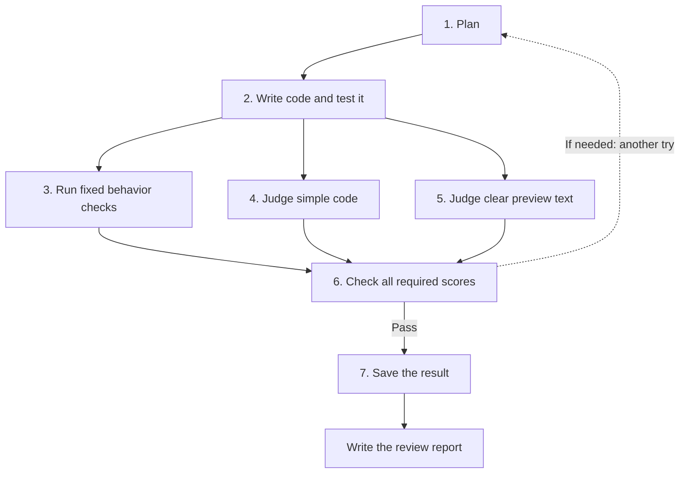

# The new run: September 24, 2026

Agentflow fixed the CSV download and added a preview. It passed all seven steps on the first work cycle. The full run took **12 minutes 52 seconds**, including its final report.

**Both read-only AI judges could run the tests this time.** The old local-server permission error did not return.

| Result | Count or score |
| --- | --- |
| App tests | 13/13 pass |
| Fixed export, listing, and preview checks | 29/29 pass |
| Simplicity judge | 1.00 |
| Clear preview text judge | 1.00 |
| Weighted score | 1.00 |
| Extra setup tests | 4/4 pass |
| Supervisor interventions | 0 |

The scores are real, but they are not a promise of a perfect app. A separate browser check found a download control that stays visible when preview loading fails. The code is kept as the agent left it.

## Start here

1. [Read what happened](operator/run-review.md), including the bugs and tool detour.
2. [See the actual scorecard](operator/scorecard.json).
3. [Read the browser check](operator/browser-review.md).
4. [Read the fairness audit](operator/graph-audit.md): this is an open-book demo, not a blind benchmark.
5. [Understand tests versus steps](operator/tests-explained.md).

## Follow the work

This is a short reading guide. Agentflow's own [compiled Mermaid file](operator/compiled-graph.mmd) contains the full generated graph. Its [compiled graph data](run/compiled_graph.json) and [launch-time graph snapshot](recorded-graph.json) are saved too. The report-writing step happens after the seven graph steps.

## Check the evidence

| I want to see… | Open |
| --- | --- |
| The report Agentflow wrote | [Review brief](run/delivery/01-review-brief.md) |
| The lessons Agentflow wrote | [Run learnings](run/delivery/02-run-learnings.md) |
| Whether the report passed its own check | [Curation verdict](run/delivery/evidence/curation-verdict.json) |
| Test output from the behavior step | [Deterministic checks](operator/deterministic-checks.log) |
| Proof the judges ran tests | [Judge log excerpts](operator/judge-test-evidence.json) |
| The two AI verdicts | [Simplicity](operator/simplicity-verdict.json), [clear text](operator/operator-clarity-verdict.json) |
| The operator's fresh checks | [App](operator/postrun-tests.log), [task](operator/postrun-acceptance.log), [setup](operator/postrun-setup-tests.log) |
| The code changed by the agent | [Patch](operator/changes.patch) |
| Run times, versions, and counts | [Run summary](operator/run-summary.json) |
| Protected files stayed the same | [Hash check](operator/postrun-integrity.json) |
| All messages, steps, and files | [Raw run folder](run/) and [audit index](run/delivery/03-audit-index.md) |
| How these files were copied | [Source and copying notes](PROVENANCE.md) |

The original before tests passed 6/6, yet the task checks passed only 16/29. The six old tests missed the broken export and did not test a preview. One graph step can run many tests.

[Back to all saved runs](../README.md)
