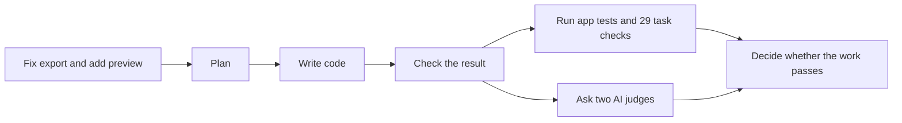

# How can six tests pass while the task is unfinished?

A test only proves what it checks.

The starting app had six tests. They checked that the customer list, filters, pagination, page, and basic HTTP responses worked. The CSV test only asked for customer C010, checked the file type, and checked that C010 appeared in the response. It did not check a whole multi-page export or tricky CSV fields.

So that test could pass even while the export dropped most matching rows or broke a company name containing a comma.

The task also asked for a new preview. The original six tests never checked for a preview.

| Name | What it means in this demo |
| --- | --- |
| Task | Fix the CSV export and add a preview. |
| Workflow step | A piece of work, such as planning, writing code, or checking the result. |
| App test | An automated check of part of the app. The starting app had six. |
| Task check | One of 29 broader checks of export, listing, and preview behavior. |
| AI review | A judgment about simple code or clear preview text. |

One workflow step can run many tests. Six passing tests does not mean six workflow steps were completed.

## The starting result

- All six original app tests passed.
- Sixteen of 29 task checks passed.
- Eight task checks found export bugs.
- Five task checks found that the preview route did not exist.

The 29 task checks break down into 12 export cases, 12 listing cases, and five preview cases. The app already passed all 12 listing cases and four export cases: 16 in total.

The bug existed before we added broader checks. The extra checks made that gap visible; they did not change the answer after the code was written.
