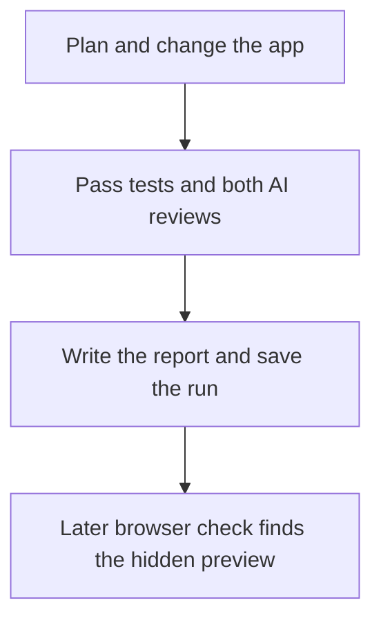

# What happened in the run

[Back to the app guide](../README.md)

Agentflow asked Codex to fix the customer CSV download and add a preview. The work passed its tests and both AI reviews on the first try. Then Agentflow wrote a report and saved the run.

A later browser check found one issue: the preview opens below the table, so you have to scroll to see it.

## The results

| Check | Before | After |
| --- | --- | --- |
| App tests | 6 of 6 passed | 12 of 12 passed |
| Export and preview checks | 16 of 29 passed | 29 of 29 passed |
| AI review of simple code | Not run | 1.00 out of 1 |
| AI review of clear preview | Not run | 1.00 out of 1 |

The overall score was **1.00 out of 1**. The pass mark was **0.85**. Each required check also had to pass on its own.

The run used **GPT-5.5 with medium reasoning**, through **Codex CLI 0.142.2**. See the [saved model log](run/nodes/002-generate-and-validate-98e034e54484/executions/i001-a001-exec-49f15c8227d21dd8/human-debug/harness/stderr.log#L4).

## Follow the run

The workflow took **10 minutes and 25 seconds**. Writing the final report took another **2 minutes and 48 seconds**. Total time: **13 minutes and 13 seconds**.

There was one try. The helper agent, called the supervisor, did not need to step in. This run shows a successful first try; it does not show the retry path in action.

## What changed in the app?

The download now includes every customer who matches the filters, even when the table is on page two. Commas, quotes, and line breaks stay in the right fields.

The new preview shows the full count, columns, filters, and a sample of five rows. It lets you download or cancel. If you change a filter, it clears the old preview.

Read the [original change summary](operator/implementation-summary.md) to see the files the AI changed.

## Why did the AI judges pass it?

**Simple code:** the judge found that the list, export, and preview share the same filter code. The fix added small, clear pieces and no extra packages.

**Clear preview:** the judge found labels for the full count, sample rows, download, cancel, and empty results. It also found checks that stop an old preview from describing a new download.

Read the [actual scores and full explanations](operator/scorecard.json). These are AI judgments based on the rules in the graph.

Both judges tried to run the tests themselves, but their restricted sessions could not start a local server. The separate test step did run and pass. Its [saved output](operator/deterministic-checks.log) contains the 12 app tests and all 29 task checks.

## What did the browser check find?

The preview worked, but it opened below the visible part of the page. Clicking the button could look like it did nothing until you scrolled down.

The AI judge read the code and screen text. It did not view the page in a browser. The later browser check was separate and did not change the AI scores.

That check tried the filters, cancel button, and no-match case. It did not fully test keyboard use, slow requests, or the browser download action. Read the [full browser notes](operator/browser-review.md).

The app here still has the scroll issue. No later fix was added to the scored code.

## Open the saved files

| I want to see… | Open |
| --- | --- |
| What the AI changed | [Change summary](operator/implementation-summary.md) |
| The scores and judge comments | [Scorecard](operator/scorecard.json) |
| The test results | [Test log](operator/deterministic-checks.log) |
| Agentflow's final report | [Review brief](run/delivery/01-review-brief.md) |
| Notes from the run | [Run notes](run/delivery/02-run-learnings.md) |
| Every step in time order | [Event log](run/events.jsonl) |
| Prompts, replies, and logs for each step | [Run steps](run/nodes/) |
| A detailed file index | [Audit index](run/delivery/03-audit-index.md) |
| Exact times and counts | [Run summary](operator/rehearsal-summary.json) |
| How these files were copied | [About the saved files](PROVENANCE.md) |

The original AI replies and logs keep their original words. This guide explains them in plain English.

For a live demo, open this page while a new run works. You can walk through the saved result without waiting for the new run to finish.
